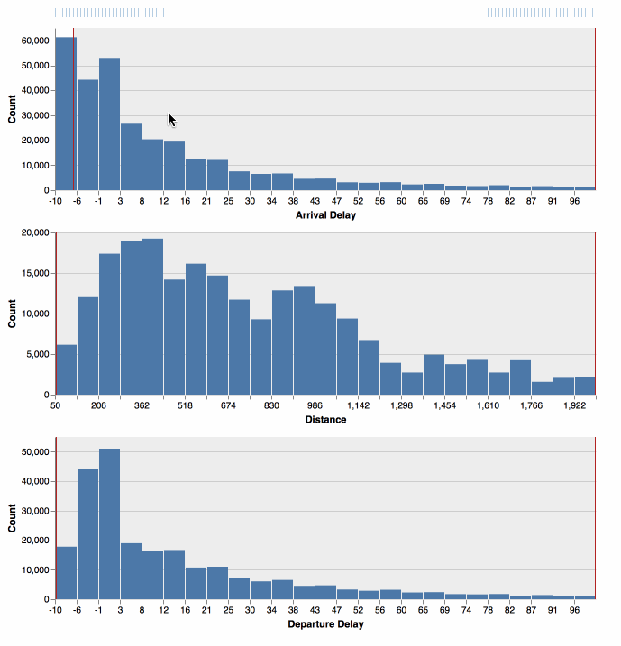

# big-crossfilter

Crossfilter millions of records without latencies. This project is work in progress and not documented yet. Please get in touch if you have questions.

The largest experiments we have done so far is 10M flights in the browser and ~180M flights when connected to MapD. 

## Demos

* 1M flights in the browser: https://uwdata.github.io/big-crossfilter/flights/
* 7M flights in [MapD](https://www.mapd.com/): https://uwdata.github.io/big-crossfilter/flights-mapd/
* 500k weather records: https://uwdata.github.io/big-crossfilter/weather/

Big Crossfilter uses [Apache Arrow](https://arrow.apache.org/) and [ndarray](https://github.com/scijs/ndarray).

## Developers

Install the dependencies with `yarn`. Then run `yarn start` to start the flight demo with in memory data. Have a look at the other `script` commands in [`package.json`](https://github.com/uwdata/big-crossfilter/blob/master/package.json).

## Experiments

First version that turned out to be too complicated is at https://github.com/uwdata/big-crossfilter/tree/complex and the client-server version is at https://github.com/uwdata/big-crossfilter/tree/client-server.
