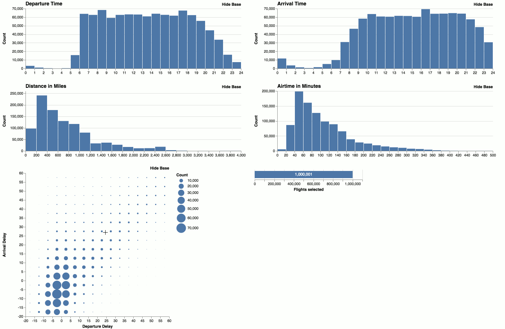
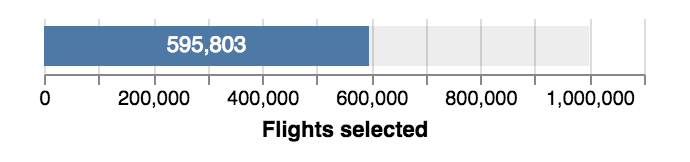
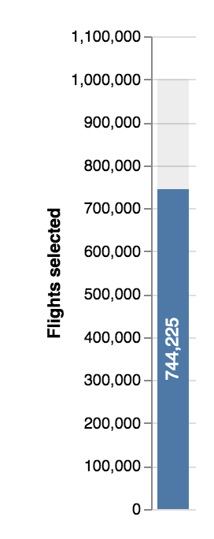
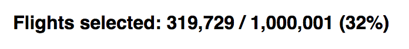
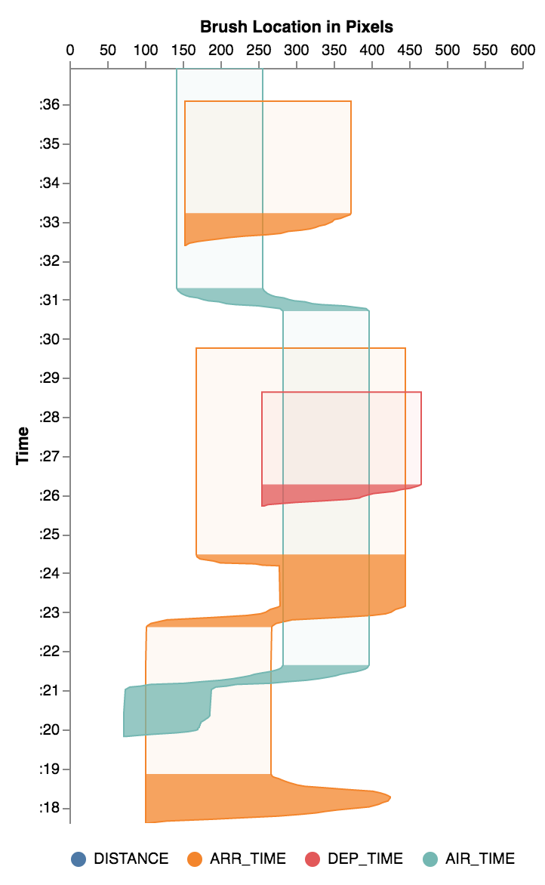

# Falcon: Interactive Visual Analysis for Big Data

Crossfilter millions of records without latencies. This project is work in progress and not documented yet. Please get in touch if you have questions.

The largest experiments we have done so far is 10M flights in the browser and ~180M flights or 1.2B stars when connected to MapD.

## Demos

- 1M flights in the browser: https://uwdata.github.io/falcon/flights/
- 7M flights in [MapD](https://www.mapd.com/): https://uwdata.github.io/falcon/flights-mapd/
- 500k weather records: https://uwdata.github.io/falcon/weather/

Falcon uses [Apache Arrow](https://arrow.apache.org/) and [ndarray](https://github.com/scijs/ndarray).

## Usage

Install with `yarn add falcon-vis`. You can use two database backends. First `ArrowDB` that works completely in the browser and scales up to ten million rows. Second, `MapDDB`, which connects to [MapD](http://mapd.com/). Check out the examples to see how to set up an app with your own data. More documentation will follow.

## Features

### Zoom

You can zoom histograms. Falcon automatically re-bins the data.

### Show and hide base

The base data, which are the original counts without filters, can be displayed behind the filtered counts to provide context. Hiding the base shows the relative distribution of the data.

With base.

Without base.

### Circles or Color Heatmap

Heatmap with circles (default). Can show the base (data without filters).

Heatmap with colored cells.

### Vertical, horizontal, or text for counts

Horizontal bar.

Vertical bar.

Text only.

### Timeline visualization

You can visualize the timeline of brush interactions in Falcon.

## Developers

Install the dependencies with `yarn`. Then run `yarn start` to start the flight demo with in memory data. Have a look at the other `script` commands in [`package.json`](https://github.com/uwdata/falcon/blob/master/package.json).

## Experiments

First version that turned out to be too complicated is at https://github.com/uwdata/falcon/tree/complex and the client-server version is at https://github.com/uwdata/falcon/tree/client-server.
