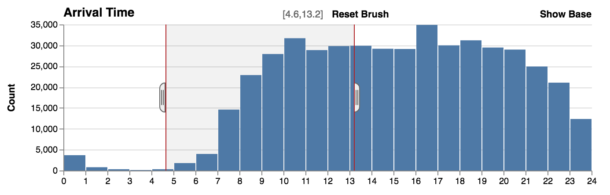
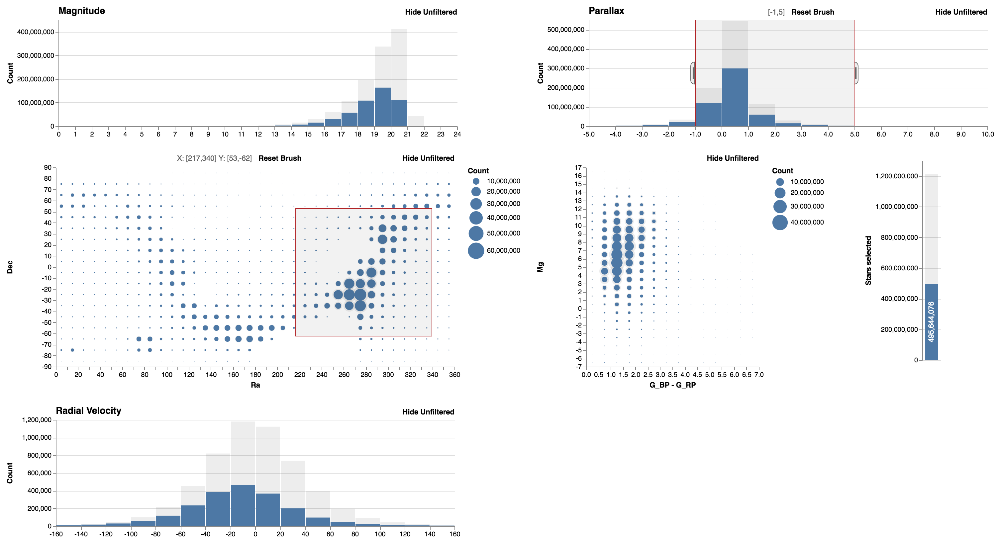

<p align="center">
  
</p>

# Falcon: Interactive Visual Analysis for Big Data

[](https://www.npmjs.com/package/falcon-vis) [](https://travis-ci.com/uwdata/falcon) [](https://github.com/prettier/prettier) [](https://greenkeeper.io/)

Crossfilter millions of records without latencies. This project is work in progress and not documented yet. Please get in touch if you have questions.

The largest experiments we have done so far is 10M flights in the browser and ~180M flights or [~1.7B stars](#falcon-with-17-billion-stars-from-the-gaia-dataset) when connected to [OmniSci Core](https://www.omnisci.com/platform/core/) (formerly known as MapD).

We have written [a paper](https://osf.io/szpqm/) about the research behind Falcon. Please cite us if you use Falcon in a publication. 

```bib
@inproceedings{Moritz2019,
  doi = {10.1145/3290605},
  year  = {2019},
  publisher = {{ACM} Press},
  author = {Dominik Moritz and Bill Howe and Jeffrey Heer},
  title = {Falcon: Balancing Interactive Latency and Resolution Sensitivity for Scalable Linked Visualizations},
  booktitle = {Proceedings of the 2019 {CHI} Conference on Human Factors in Computing Systems  - {CHI} {\textquotesingle}19}
}
```

## Demos

- 1M flights in the browser: https://uwdata.github.io/falcon/flights/
- 7M flights in [OmniSci Core](https://www.omnisci.com/platform/core/): https://uwdata.github.io/falcon/flights-mapd/
- 500k weather records: https://uwdata.github.io/falcon/weather/


## Usage

Install with `yarn add falcon-vis`. You can use two query engines. First `ArrowDB` reading data from [Apache Arrow](https://arrow.apache.org/). This engine works completely in the browser and scales up to ten million rows. Second, `MapDDB`, which connects to OmniSci Core. The indexes are created as [ndarrays](https://github.com/scijs/ndarray). Check out the examples to see how to set up an app with your own data. More documentation will follow.

## Features

### Zoom

You can zoom histograms. Falcon automatically re-bins the data.


### Show and hide unfiltered data

The original counts without filters, can be displayed behind the filtered counts to provide context. Hiding the unfiltered data shows the relative distribution of the data.

With unfiltered data.


Without unfiltered data.



### Circles or Color Heatmap

Heatmap with circles (default). Can show the data without filters.


Heatmap with colored cells.


### Vertical bar, horizontal bar, or text for counts

Horizontal bar.


Vertical bar.


Text only.


### Timeline visualization

You can visualize the timeline of brush interactions in Falcon.


## Falcon with 1.7 Billion Stars from the GAIA Dataset

The [GAIA spacecraft](<https://en.wikipedia.org/wiki/Gaia_(spacecraft)>) measured the positions and distances of stars with unprecedented precision. It collected about 1.7 billion objects, mainly stars, but also planets, comets, asteroids and quasars among others. Below, we show the dataset loaded in Falcon (with OmniSci Core). There is also a [video of me interacting with the dataset through Falcon](images/gaia.mp4).



## Developers

Install the dependencies with `yarn`. Then run `yarn start` to start the flight demo with in memory data. Have a look at the other `script` commands in [`package.json`](https://github.com/uwdata/falcon/blob/master/package.json).

## Experiments

First version that turned out to be too complicated is at https://github.com/uwdata/falcon/tree/complex and the client-server version is at https://github.com/uwdata/falcon/tree/client-server.
