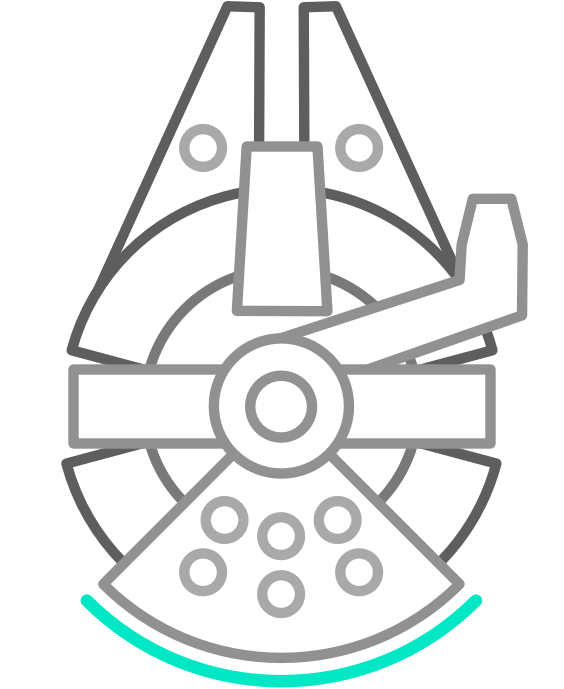

<p align="center">
  
</p>

# Falcon: A Library for Interactive Visual Analysis for Big Data


[](https://github.com/prettier/prettier)

**🚧 Work in Progress**

Crossfilter millions of records without latencies. This is a new **library** version of [Falcon](https://github.com/vega/falcon) with a new API to use falcon
with your own visualizations.

### Getting Started Developing

#### Installation

First install the dependencies for the entire workspace with

```bash
yarn
```

#### Running the 10k flights example with Falcon

Then, run the following to start the `examples/flights` svelte demo that uses the Arrow format with Falcon on 10k flights.

```bash
yarn start:flights
```
